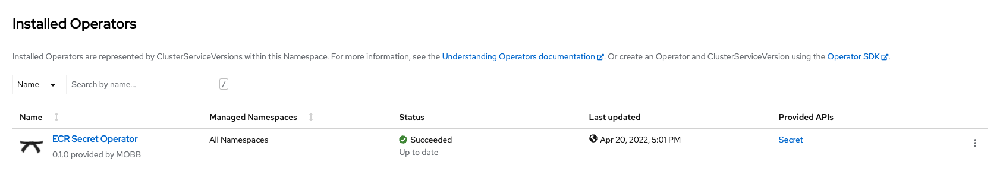

# ECR Secret Operator

Amazon Elastic Container Registry [Private Registry Authentication](https://docs.aws.amazon.com/AmazonECR/latest/userguide/registry_auth.html) provides a temporary authorization token valid only for 12 hours. This operator refreshes automatically the Amazon ECR authorization token before it expires, reducing the overhead in managing the authentication flow during the container image build process.

This operator uses Amazon ECR [`GetAuthorizationToken`](https://docs.aws.amazon.com/AmazonECR/latest/APIReference/API_GetAuthorizationToken.html) API to create or update the secret, linked to an OpenShift service account that can transparently perform container image builds.

## How to use this operator

### Prerequisites

* [Create an Amazon ECR private repository](https://docs.aws.amazon.com/AmazonECR/latest/userguide/repository-create.html)
* Create An OpenShift Cluster
* Configure AWS authentication method. Two options:
  * [AWS IAM User](./docs/iam_user.md)
  * [AWS STS AssumeRole](./docs/iam_assume_role.md)
* Install the [Operator SDK CLI](https://sdk.operatorframework.io/docs/installation/)

### Install the operator

```bash
oc new-project ecr-secret-operator
operator-sdk run bundle quay.io/mobb/ecr-secret-operator-bundle:v0.4.0
```



### Create the ECR Secret Image Pull CRD

```yaml
apiVersion: ecr.mobb.redhat.com/v1alpha1
kind: Secret
metadata:
  name: ecr-secret
  namespace: test-ecr-secret-operator
spec:
  generated_secret_name: ecr-docker-secret
  ecr_registry: [ACCOUNT_ID].dkr.ecr.us-east-2.amazonaws.com
  frequency: 10h
  region: us-east-2
```

```bash
oc create -f samples/ecr_v1alpha1_secret.yaml
```

A Docker registry secret is created by the operator temporarily and the token is patched every 10 hours

```bash
oc get secret ecr-docker-secret   
NAME                TYPE                             DATA   AGE
ecr-docker-secret   kubernetes.io/dockerconfigjson   1      16h
```

### A sample build process with generated secret

Link the secret to builder

```bash
oc secrets link builder ecr-docker-secret 
```

Configure [build config](./samples/build-config.yaml) to point to your Amazon ECR Container repository

```bash
oc create imagestream ruby
oc tag openshift/ruby:2.5-ubi8 ruby:2.5
oc create -f samples/build-config.yaml
oc start-build ruby-sample-build --wait
```

The build should succeed and push the image to the the private Amazon ECR Container repository


### Create the ECR Secret Argo CD Helm Repo CRD

* Argo CD installed
* [Helm chart stored in ecr](https://docs.aws.amazon.com/AmazonECR/latest/userguide/push-oci-artifact.html)

```bash
export ACCOUNT_AWS_ID=
cat << EOF | oc apply -f -
apiVersion: ecr.mobb.redhat.com/v1alpha1
kind: ArgoHelmRepoSecret
metadata:
  name: helm-repo
  namespace: openshift-gitops
spec:
  generated_secret_name: ecr-argo-helm-secret
  url: ${AWS_ACCOUNT_ID}.dkr.ecr.us-east-2.amazonaws.com
  frequency: 10h
  region: us-east-2
EOF
cat << EOF | oc apply -f -
apiVersion: argoproj.io/v1alpha1
kind: Application
metadata:
  name: test
spec:
  destination:
    name: ''
    namespace: default
    server: 'https://kubernetes.default.svc'
  source:
    path: ''
    repoURL: ${AWS_ACCOUNT_ID}.dkr.ecr.us-east-2.amazonaws.com
    targetRevision: 0.1.0
    chart: helm-test-chart
  project: default
EOF
```

```bash
oc create -f samples/ecr_v1alpha1_argohelmreposecret.yaml
```
